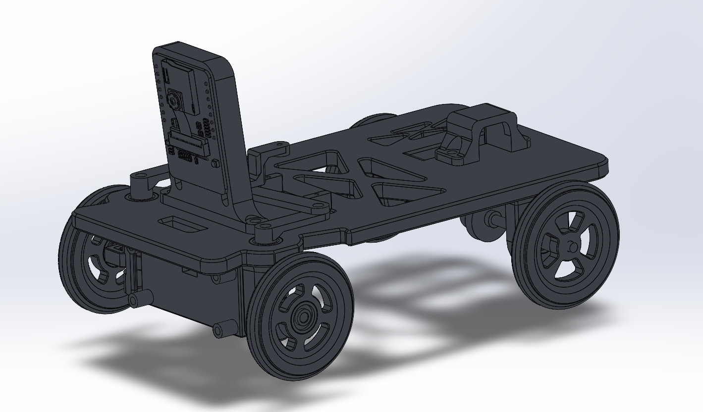
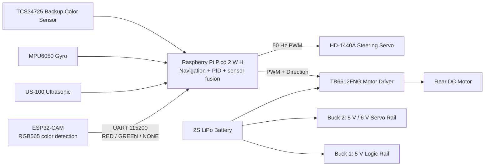
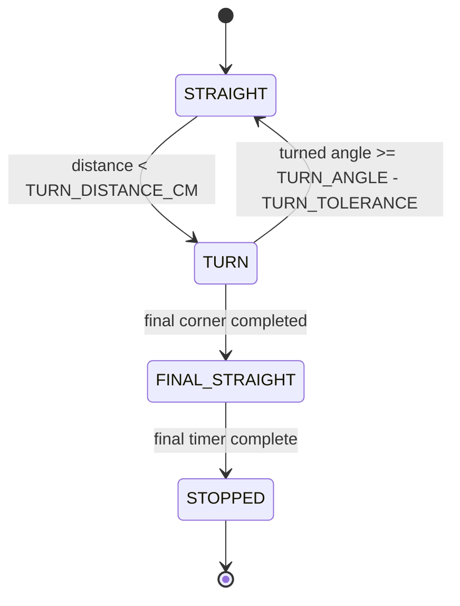
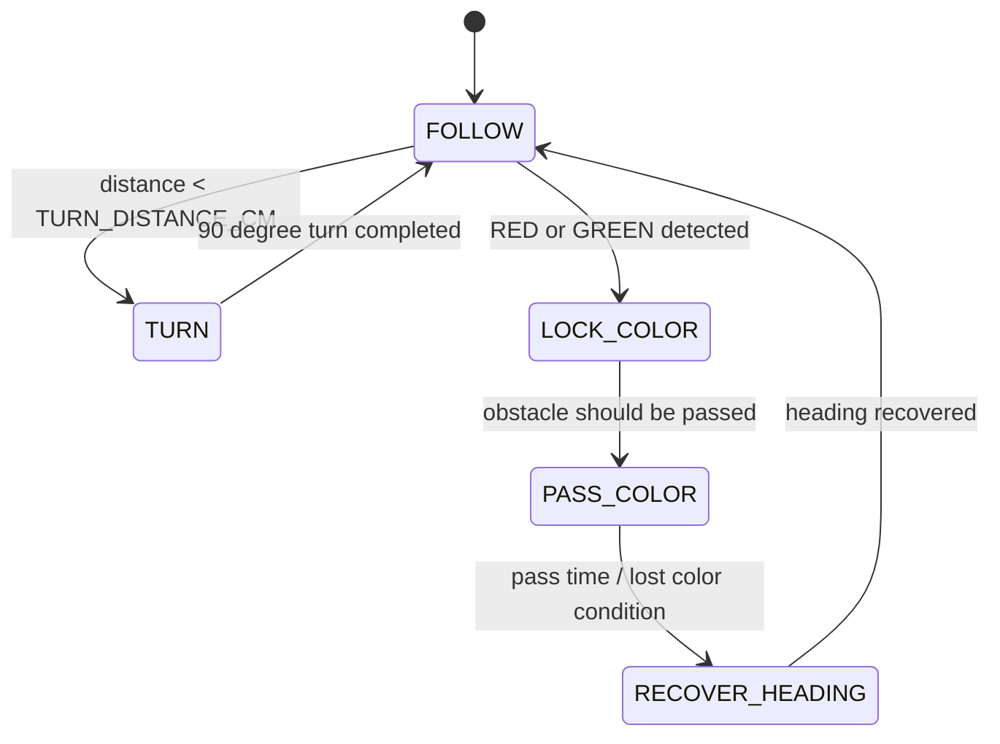

# WRO 2026 Future Engineers - Team CYBERRCORE

<div style="text-align: center;">
  
</div>

This repository contains Team **CYBERRCORE**'s autonomous vehicle documentation for **WRO 2026 Future Engineers**. The goal of this repository is not only to show the final robot, but also to make the complete engineering process reproducible: mechanical CAD, electronics wiring, software architecture, testing workflow, and engineering trade-offs are all documented in separate folders.

The robot is designed for both the **Open Round** and **Obstacle Round**. It uses a Raspberry Pi Pico 2 W H as the main controller, an ESP32-CAM as a dedicated vision module, ultrasonic wall sensing, gyro-based heading estimation, Ackermann-style steering, and a custom 3D-printed drivetrain.

---

## Robot Documentation Preview

| Mechanical CAD | Electronics Wiring |
| --- | --- |
|  |  |

| Bench Build | Track Testing |
| --- | --- |
|  |  |

---

## Repository Map

| Folder / File | Contents | Why it matters |
| --- | --- | --- |
| [`src/`](src/) | ESP32-CAM firmware, Raspberry Pi Pico MicroPython scripts, state-machine logic, PID control, test utilities | Shows how the autonomous behavior is implemented and tuned |
| [`schemes/`](schemes/) | Full wiring scheme, electronics BOM, signal tables, voltage rails, current budget | Allows judges or other teams to reproduce the electrical system safely |
| [`models/`](models/) | CAD renders, mechanical explanations, chassis, steering, drivetrain, mounts, wheels | Documents the robot's physical design and engineering reasoning |
| [`models/STL/`](models/STL/) | Print-ready STL files for all custom mechanical parts | Enables direct reproduction of the 3D-printed robot body |
| [`v-photos/`](v-photos/) | Six required robot views: front, rear, top, bottom, left, right | Physical evidence of the built prototype |
| [`t-photos/`](t-photos/) | Official and fun team photos | Team identification |
| [`video/`](video/) | Links to open-round and obstacle-round run videos | Demonstrates real robot performance |
| [`CYBERRCORE_Technical_Documentation.pdf`](CYBERRCORE_Technical_Documentation.pdf) | Complete technical report | Printable engineering documentation |

---

## Engineering Rubric Coverage

| WRO judging criterion | Repository evidence |
| --- | --- |
| Mobility and mechanical design | `models/README.md`, CAD previews, STL files, chassis layout, Ackermann steering, differential drivetrain |
| Power and sensor architecture | `schemes/README.md`, wiring scheme, BOM, voltage rails, signal tables, power budget |
| Software architecture | `src/README.md`, ESP32-CAM firmware, Pico MicroPython files, UART protocol, PID parameters |
| Obstacle strategy | Camera color detection, red/green target logic, obstacle state machine, gyro recovery |
| Repeatability and testing | Servo tuning script, camera UART test, validation tables, reproduction checklist |
| Engineering decisions | Trade-off tables explaining why each subsystem was selected |

---

## 1. System Overview

Team CYBERRCORE's robot is a fully autonomous four-wheeled vehicle built for WRO 2026 Future Engineers. The architecture is split into mechanical, electrical, and software subsystems so each part can be tested independently before full autonomous runs.

The robot uses:

| Subsystem | Technology | Role |
| --- | --- | --- |
| Main controller | Raspberry Pi Pico 2 W H | Runs MicroPython navigation, PID steering, sensor fusion, motor control, and lap counting |
| Vision module | ESP32-CAM | Detects red and green obstacles using RGB565 image processing |
| Motor driver | TB6612FNG | Controls the brushed DC drive motor with PWM and direction pins |
| Drive motor | 6 V micro DC motor | Provides rear-wheel propulsion through a spur-gear drivetrain |
| Steering | HD-1440A servo | Drives the front Ackermann steering linkage |
| Distance sensor | US-100 ultrasonic sensor | Detects walls, corners, and close-range safety distance |
| IMU / gyro | MPU6050 | Estimates yaw for 90 degree turns and heading recovery |
| Color sensor | TCS34725 | Backup / future validation module for color sensing |
| Battery | 2S 450 mAh 40C LiPo | Main power source, 7.4 V nominal and 8.4 V fully charged |
| Voltage regulation | 2x LM2596 / RT3505 buck converters | Separate logic and servo power rails |
| Mechanical structure | SolidWorks + FDM 3D printing | Custom chassis, mounts, gears, wheels, and steering parts |

### High-level control architecture



The ESP32-CAM handles vision separately so the Pico does not need to process camera frames. The Pico receives simple UART messages and combines them with ultrasonic distance and gyro yaw to decide when to drive straight, avoid obstacles, turn corners, recover heading, or stop after the required number of laps.

---

## 2. Mechanical Design

The mechanical platform is designed around three priorities:

1. **Low center of gravity** for stable driving at speed.
2. **Repeatable steering geometry** for consistent cornering.
3. **Easy reproduction** using printable CAD/STL files.

All custom mechanical components were designed in SolidWorks and manufactured using FDM 3D printing. PLA is used for prototyping, while PETG or ABS is recommended for competition versions where stronger temperature and impact resistance are useful.

---

### 2.1 Main Chassis

The main chassis uses a single-level flat-plate structure. This keeps the robot low and leaves enough surface area for electronics, wiring, motor placement, servo placement, and sensor mounts.

| Feature | Description |
| --- | --- |
| Architecture | Single-level flat plate |
| Center of gravity | Low CG improves stability during fast turns |
| Lightening cutouts | X-pattern triangular pockets reduce mass while preserving load paths |
| Standoff columns | Molded-in posts allow direct PCB and cover mounting |
| Subsystem zones | Dedicated areas for motor, servo, differential, and sensor brackets |
| Perimeter rail | Continuous edge flange supports external bracket attachment |
| Recommended print settings | 40-60% infill, gyroid pattern, layer lines perpendicular to primary stress direction |

The X-pattern cutouts reduce weight without removing material from the major structural paths. This helps the robot remain light enough for speed while still resisting flex during steering and drivetrain loads.

---

### 2.2 Steering System - 4-Part Ackermann Linkage

The front steering system uses an Ackermann-style linkage. In a turn, the inner front wheel needs to rotate at a sharper angle than the outer wheel because it travels around a smaller radius. The custom linkage is designed to make the front wheels point toward a common turning center, reducing tire scrub and improving repeatability.

| Part | Role | Key feature |
| --- | --- | --- |
| `Steer1` - Steering knuckle | Connects wheel spindle to chassis upright | L-shaped bracket; upper hole for servo pin and lower hole for chassis pivot |
| `Steer2` - Tie rod | Transmits servo motion to both front knuckles | Flat bar with equal-diameter holes; designed for low backlash |
| `Steer3` - Left arm | Converts servo rotation to left wheel angle | Asymmetric boss compensates for Ackermann geometry |
| `Steer4` - Right arm | Mirrored steering arm for the right side | Cylindrical boss for shaft engagement; mirrored from the left side |

This steering design is more complex than a simple direct-servo steering setup, but it gives more realistic vehicle behavior and better corner consistency.

---

### 2.3 Rear Drivetrain and Differential

The rear drivetrain uses a 1:1 spur-gear pair to transfer motor torque to the rear axle. The gear set uses **31-tooth to 31-tooth gears** with a **0.8 module**.

| Parameter | Value | Reason |
| --- | --- | --- |
| Gear module | 0.8M | Compact pitch suitable for small printed drivetrains |
| Tooth count | 31T : 31T | 1:1 ratio preserves motor RPM |
| Drive ratio | 1:1 | Prioritizes speed while relying on low vehicle mass for sufficient torque |
| Bearing type | 3x10x4 radial ball bearings | Reduces friction and improves lap-to-lap consistency |
| Differential | Custom printed differential | Allows rear wheels to rotate at different speeds during turns |

The differential is important because the inside and outside rear wheels travel different distances in a turn. Without differential action, the inside rear wheel can scrub against the floor, causing inconsistent cornering and possible heading errors.

---

### 2.4 Wheels and Tires

The front and rear wheels are designed differently because they have different jobs.

| Aspect | Front wheel | Rear wheel |
| --- | --- | --- |
| Hub type | Recessed bearing seat for press-fit 3x10x4 bearing | Direct shaft hub, no bearing |
| Spoke pattern | 4 spokes with intermediate web | 4 solid spokes, lighter |
| Function | Free rotation around a fixed spindle | Fixed to driven axle shaft |
| Tire fit | O-ring press-fit over outer rim flange | O-ring press-fit over outer rim flange |

The tires use an O-ring / torus profile with circumferential grip grooves. This makes tire replacement fast and keeps the rolling geometry consistent between test sessions.

---

### 2.5 Sensor and Electronics Mounts

The robot uses dedicated printed mounts for the camera, ultrasonic sensor, and motor. This improves repeatability because sensor angles and drivetrain alignment are defined by printed geometry instead of temporary hand placement.

| Mount | Key features |
| --- | --- |
| Camera mount `CamMount` | Tall vertical bracket, two vertical adjustment slots, angled forward lean for near-field obstacle detection, two M3 base holes |
| US-100 mount `US100_Mount` | Box bracket, square sensor cutout, side snap-tab retention, four corner mounting holes |
| Motor mount `motorMount` | U-bracket wrapping motor on three sides, snap-clip tool-free removal, two M3 base holes, built-in gear alignment |

The camera mount height can be adjusted to tune how early the ESP32-CAM sees obstacles. The ultrasonic mount keeps the US-100 facing forward so wall distance measurements stay consistent.

---

## 3. Electronics and Wiring

The electronics architecture separates motor power, logic power, and servo power to reduce noise and avoid brownouts. All modules share a common ground reference.

### 3.1 Bill of Materials

| Component | Quantity | Type | Description |
| --- | ---: | --- | --- |
| Raspberry Pi Pico 2 W H | 1 | Main MCU | MicroPython controller for steering, motor, sensors, and navigation |
| ESP32-CAM | 1 | Camera module | RGB565 color detection and UART obstacle reporting |
| TB6612FNG | 1 | Motor driver | PWM + direction control for brushed DC motor |
| 6 V micro DC motor | 1 | Drive motor | Rear-wheel propulsion through spur gears |
| HD-1440A servo | 1 | Steering servo | PWM-controlled Ackermann steering |
| US-100 ultrasonic sensor | 1 | Distance sensor | Wall detection, corner trigger, safety stop |
| MPU6050 | 1 | IMU / gyro | Yaw estimation for turns and heading recovery |
| TCS34725 | 1 | Color sensor | Backup / future color validation |
| LM2596 / RT3505 buck converter | 2 | Voltage regulator | Buck 1 for 5 V logic, Buck 2 for servo rail |
| 2S 450 mAh 40C LiPo | 1 | Battery | Main power source |
| On/off switch | 1 | Power switch | Manual power cut |
| 3x10x4 bearings | 4+ | Hardware | Front wheel and rear shaft support |
| M3 fasteners / washers | TBD | Hardware | Chassis, mounts, and brackets |

---

### 3.2 Power Architecture

The 2S LiPo battery provides **7.4 V nominal** and **8.4 V when fully charged**. It feeds three main destinations through the on/off switch:

1. Buck 1 input for the 5 V logic rail.
2. Buck 2 input for the servo rail.
3. TB6612FNG VM motor power input directly.

#### Main power input

| From | To | Voltage | Peak current | Notes |
| --- | --- | --- | --- | --- |
| 2S LiPo + | On/off switch input | 7.4-8.4 V | 2.5 A | Full-load peak across all rails |
| Switch output | Buck 1 input | 7.4-8.4 V | 0.6 A | Logic rail input |
| Switch output | Buck 2 input | 7.4-8.4 V | 1.0 A | Servo rail input |
| Switch output | TB6612FNG VM | 7.4-8.4 V | 1.0 A | Direct battery power for motor |
| 2S LiPo - | Common GND bus | 0 V | - | Shared ground reference |

#### Buck 1 - 5 V logic rail

| From | To | Voltage | Current | Notes |
| --- | --- | --- | --- | --- |
| Buck 1 OUT+ | Pico VBUS | 5.0 V | 50-100 mA | Powers Pico onboard 3.3 V regulator |
| Buck 1 OUT+ | ESP32-CAM 5V | 5.0 V | 100-400 mA | Camera current depends on operation |
| Buck 1 OUT+ | TB6612FNG VCC | 5.0 V | 1-5 mA | Logic supply only |

Total estimated Buck 1 output load: **400-500 mA**.

#### Buck 2 - servo rail

| From | To | Voltage | Current | Notes |
| --- | --- | --- | --- | --- |
| Buck 2 OUT+ | HD-1440A servo red wire | 5.0 V default, optional 6.0 V | 10-1000 mA | Up to 1 A peak under load |

Buck 2 should be set to **5 V by default**. A 6 V servo rail can be used for more steering torque and speed only if the wiring, servo, and regulator are verified to support it.

#### Pico 3.3 V sensor rail

| From | To | Voltage | Current | Notes |
| --- | --- | --- | --- | --- |
| Pico 3V3 OUT | TCS34725 VCC | 3.3 V | ~5 mA | Color sensor |
| Pico 3V3 OUT | MPU6050 VCC | 3.3 V | ~4 mA | Gyro + accelerometer |
| Pico 3V3 OUT | US-100 VCC | 3.3 V | ~20 mA | Ultrasonic measurement pulse |
| Pico GND | All sensor grounds | 0 V | - | Common reference |

Total estimated Pico 3.3 V sensor load: **30-40 mA**, within the Pico regulator capacity.

---

### 3.3 Signal and Data Lines

| From | To | Voltage | Notes |
| --- | --- | --- | --- |
| Pico GPIO 14 PWM | HD-1440A servo signal | 3.3 V | 50 Hz PWM, 1-2 ms pulse |
| Pico GPIO 16 PWM | TB6612FNG PWMA | 3.3 V | Motor speed control |
| Pico GPIO 17 | TB6612FNG AIN2 | 3.3 V | Motor direction |
| Pico GPIO 18 | TB6612FNG AIN1 | 3.3 V | Motor direction |
| Pico GPIO 19 | TB6612FNG STBY | 3.3 V | Must be HIGH to enable motor output |
| Pico GPIO 4 SDA | MPU6050 SDA / TCS34725 SDA | 3.3 V | Shared I2C data |
| Pico GPIO 5 SCL | MPU6050 SCL / TCS34725 SCL | 3.3 V | Shared I2C clock |
| Pico GPIO 10 | US-100 TRIG | 3.3 V | 10 microsecond trigger pulse |
| Pico GPIO 11 | US-100 ECHO | 3.3 V | Echo input |
| ESP32-CAM TX | 1k + 2k divider to Pico GPIO 1 RX | 5 V to 3.3 V | Level shift required |
| Pico GPIO 0 TX | ESP32-CAM RX | 3.3 V | Compatible with ESP32-CAM RX |

> Important: measure both buck converter outputs with a multimeter before connecting the Pico, ESP32-CAM, sensors, or servo.

---

### 3.4 Power Budget

| Rail | Consumers | Typical current | Peak current |
| --- | --- | ---: | ---: |
| Battery direct to TB6612FNG VM | DC motor | ~300 mA | 1.0 A |
| Buck 1 - 5 V logic | Pico + ESP32-CAM + TB6612FNG logic | ~250 mA | ~505 mA |
| Buck 2 - servo rail | HD-1440A servo | ~10 mA idle | 1.0 A |
| Pico 3.3 V out | MPU6050 + TCS34725 + US-100 | ~29 mA | ~40 mA |
| Total battery load | All rails combined | ~590 mA | ~2.5 A |

This power separation helps prevent motor and servo current spikes from resetting the logic boards.

---

## 4. Software Architecture

The software is divided between the ESP32-CAM and the Raspberry Pi Pico.

| File | Platform | Purpose |
| --- | --- | --- |
| `camera.cpp` | ESP32-CAM / Arduino C++ | RGB565 color detection for red and green obstacles; UART output |
| `camera_uart_blink.py` | Pico / MicroPython | Isolated UART receiver test; blinks LED on camera messages |
| `openround.py` | Pico / MicroPython | Open-round navigation with gyro-assisted 90 degree turns |
| `obstacleround.py` | Pico / MicroPython | Obstacle-round navigation, camera tracking, gyro recovery, lap counting |
| `servo_tune.py` | Pico / MicroPython | Servo center, direction, and steering tuning utility |

---

### 4.1 ESP32-CAM Vision System

The ESP32-CAM captures **QQVGA 160x120** RGB565 frames and scans the lower image region beginning at `ROI_Y_START = 30`. Pixels are sampled with a 2x2 step, converted from RGB565 to RGB888, and tested against threshold rules.

The output is sent to the Pico over UART at **115200 baud**.

#### UART protocol

One line is sent per frame:

```text
RED,<center_x>,<pixel_count>
GREEN,<center_x>,<pixel_count>
NONE
```

| Detection | Rule |
| --- | --- |
| Red | High red channel, low green/blue channels, red dominates other channels |
| Green | High green channel, limited red/blue channels, green dominates other channels |
| Priority | If both colors are visible, red is prioritized when red area is at least equal to green area |
| Minimum area | Color must exceed `RED_MIN_AREA` or `GREEN_MIN_AREA` before being reported |

The Pico does not process image frames directly. It only receives the detected color, horizontal center position, and pixel area.

---

### 4.2 Open Round Navigation

`openround.py` implements a deterministic state machine for repeated 90 degree turns. The robot drives straight until the US-100 detects a wall closer than `TURN_DISTANCE_CM`. Then it turns using gyro yaw until the target turn angle is reached.

After `STOP_AFTER_TURNS = 16`, the robot enters the final stop sequence.



| State | Condition to leave | Next state |
| --- | --- | --- |
| `STRAIGHT` | Distance below corner threshold | `TURN` |
| `TURN` | Gyro angle reaches target turn angle | `STRAIGHT` or `FINAL_STRAIGHT` |
| `FINAL_STRAIGHT` | Final forward timer completes | `STOPPED` |
| `STOPPED` | None | None |

---

### 4.3 Obstacle Round Navigation

`obstacleround.py` extends the open-round logic with camera-based obstacle behavior. It combines:

- UART color data from ESP32-CAM.
- US-100 ultrasonic corner detection.
- MPU6050 gyro heading control.
- Multi-state obstacle passing.
- Corner and lap counting.

The robot tracks `corner_count` and `lap_count`, and stops after `REQUIRED_LAPS = 4`.

| Obstacle | Target camera X | Passing strategy |
| --- | ---: | --- |
| Red | `RED_TARGET_X = 48` | Pass on the right |
| Green | `GREEN_TARGET_X = 112` | Pass on the left |
| None visible | - | Drive forward with gyro-assisted heading correction |

Obstacle-round logic keeps the vehicle from reacting randomly to short camera dropouts. If the camera briefly loses the obstacle, the robot can keep a short bias from the last known color and then recover to the target heading.



#### Risk handling in obstacle round

| Risk | Mitigation |
| --- | --- |
| False ultrasonic readings at close range | Reject distances below `MIN_VALID_DISTANCE_CM` |
| Same wall counted twice after a turn | `TURN_IGNORE_AFTER_TURN_MS` blocks immediate re-trigger |
| Corner trigger during obstacle avoidance | `TURN_IGNORE_AFTER_COLOR_MS` delays corner detection |
| Camera briefly loses obstacle | `LOST_COLOR` keeps short steering bias from last known color |
| Two obstacles close together | `chain_active` extends pass duration and increases bias |
| Gyro drift after maneuvers | Yaw and PID state reset after turns and recovery events |
| UART partial messages | Buffer is bounded; lines parsed only after newline termination |

---

### 4.4 PID Steering Control

The robot uses discrete PID steering control for heading correction.

```text
error = target_yaw - yaw
integral += error * dt
derivative = (error - last_error) / dt
output = (KP * error) + (KI * integral) + (KD * derivative)
```

| Parameter | Open Round | Obstacle Round |
| --- | ---: | ---: |
| `SERVO_MIN` | 30 | 50 |
| `SERVO_CENTER` | 65 | 65 |
| `SERVO_MAX` | 100 | 80 |
| `KP` | 1.8 | 2.4 (`KP_HEADING`) |
| `KI` | 0.00 | - |
| `KD` | 0.25 | 0.35 (`KD_HEADING`) |
| `MOTOR_SPEED_STRAIGHT` | 30 | 65 (`FOLLOW`) |
| `MOTOR_SPEED_TURN` | 50 | 57 |
| `TURN_DISTANCE_CM` | - | 45 |
| `STOP_DISTANCE_CM` | - | 6 |

The steering output is clamped to the servo limits. Open-round tuning prioritizes clean 90 degree turns, while obstacle-round tuning prioritizes faster heading recovery after avoidance maneuvers.

---

## 5. Vehicle Photos

The `v-photos/` folder contains six required views of the physical robot. These photos show the current prototype build used during development and testing.

| View | What it shows |
| --- | --- |
| Front | ESP32-CAM on custom bracket, US-100 under the front nose, blue steered front wheels |
| Rear | 0.8M 31T spur gear on rear axle, brushed DC motor in U-bracket, toggle switch, battery connector |
| Top | Prototype wiring, electronics platform, camera location, support columns |
| Bottom | Ackermann steering linkage, servo placement, rear gear pair, X-pattern chassis pockets |
| Left | Height stack: flat chassis, electronics platform, ESP32-CAM tower |
| Right | Rear gear train, motor, pinion, driven axle gear, front vs rear wheel hub difference |

The prototype photos may still show breadboard wiring and temporary cable routing. Final competition wiring should be cleaned and secured before official runs.

---

## 6. Validation and Testing

Validation is separated into mechanical, electronics, and software/track checks. This makes it easier to find problems before a full autonomous run.

### 6.1 Mechanical Validation

| Test | Procedure | Pass criteria |
| --- | --- | --- |
| Steering range | Move servo from min to max while wheels are lifted | Full travel without binding or wheel/chassis contact |
| Ackermann behavior | Observe inner and outer wheel angles during turns | Inner wheel turns more sharply than outer wheel in both directions |
| Gear mesh | Hand-spin drivetrain, then test at low PWM | No skipping, tight spots, or visible gear wobble |
| Differential action | Hold one wheel and rotate the opposite wheel | Allows relative motion without excessive friction |
| Bearing fit | Press bearing and spin wheel | Bearing seated, wheel rotates freely, no lateral play |
| Sensor mount rigidity | Lightly shake chassis | Camera and US-100 angle does not shift |
| Track clearance | Roll through practice corner | No chassis, wire, or mount scraping |

---

### 6.2 Electronics Validation

| Check | Method | Failure response |
| --- | --- | --- |
| Voltage rails | Measure buck outputs before connecting boards | Do not connect until output is corrected |
| I2C sensors | Confirm MPU6050 and TCS34725 addresses | Inspect SDA, SCL, power, and ground |
| UART camera | Verify `RED`, `GREEN`, and `NONE` messages | Use `camera_uart_blink.py` for isolated testing |
| Ultrasonic | Compare readings against known distances | Reject invalid values; inspect TRIG/ECHO wiring |
| Motor polarity | Test with wheels lifted | Swap motor leads or invert direction logic |
| Servo direction | Run `servo_tune.py` | Adjust reverse/settings before autonomous code |

---

### 6.3 Software and Track Validation

| Test | Procedure | Pass criteria |
| --- | --- | --- |
| Camera detection | Show red, green, and no object to ESP32-CAM | Serial output changes between `RED`, `GREEN`, and `NONE` within one frame |
| UART receiver | Run `camera_uart_blink.py` with camera connected | Red causes 1 blink, green causes 2 blinks, no spam on sustained color |
| Open round | Run `openround.py` on practice track | Completes 16 corners without double-counting walls |
| Obstacle round | Run `obstacleround.py` with red/green obstacles | Red and green are passed on the correct side; heading recovers |
| Lap counting | Full 4-lap run | Robot stops after exactly 4 laps |

---

## 7. Reproduction Checklist

Follow this order when building the robot from the repository.

1. Print all required custom parts from [`models/STL/`](models/STL/).
2. Assemble the main chassis, steering linkage, rear axle, differential, wheel hubs, and tires.
3. Check steering movement manually before installing electronics.
4. Install the motor mount, rear gear pair, and rear drivetrain.
5. Mount the ESP32-CAM and US-100 using the printed brackets.
6. Wire the electronics according to [`schemes/electronicsheme.jpeg`](schemes/electronicsheme.jpeg).
7. Verify the 5 V logic buck output with a multimeter.
8. Verify the 5 V / 6 V servo buck output with a multimeter.
9. Confirm that all modules share common ground.
10. Upload [`src/camera.cpp`](src/camera.cpp) to the ESP32-CAM.
11. Copy the selected MicroPython file to the Raspberry Pi Pico.
12. Run [`src/servo_tune.py`](src/servo_tune.py) to set center, direction, and limits.
13. Run [`src/camera_uart_blink.py`](src/camera_uart_blink.py) to test UART communication.
14. Validate open round using [`src/openround.py`](src/openround.py).
15. Validate obstacle round using [`src/obstacleround.py`](src/obstacleround.py).
16. Record final competition videos and place the links in [`video/`](video/).

---

## 8. Engineering Decisions and Trade-offs

| Decision | Why chosen | Trade-off |
| --- | --- | --- |
| Separate ESP32-CAM vision module | Offloads camera processing from the Pico and gives a simple UART interface | Requires a second board, stable serial wiring, and level shifting |
| TB6612FNG VM powered directly from battery | Reduces converter losses and gives stronger motor power | Motor speed changes slightly as battery voltage drops |
| Dual buck converters | Separates logic and servo current spikes | More wiring and both regulators must be verified |
| 1:1 spur gear drivetrain | Preserves full motor RPM for straight-line speed | Less torque multiplication; depends on low robot mass |
| Differential rear axle | Reduces inside-wheel scrub during turns | More printed parts and alignment checks |
| RGB thresholding instead of ML | Fast, simple, tunable on ESP32-CAM | Sensitive to lighting and venue color conditions |
| Gyro-based 90 degree turns | More repeatable than timing-only turns | Requires calibration and drift handling |
| US-100 corner detection | Simple direct wall measurement | Needs filtering for close-range noise |
| State-machine control | Easy to debug and explain to judges | More transition timing to tune |
| Flat-plate chassis with X cutouts | Low CG and simple mounting while reducing mass | Less rigid than a box frame; print orientation matters |
| Ackermann steering linkage | Reduces tire scrub and improves repeatability | More parts to align |
| O-ring tires | Simple replacement and consistent geometry | Less traction tuning than molded tire compounds |
| `run_log.txt` logging | Allows post-run diagnosis without live serial monitoring | File writes must not block the control loop |

---

## 9. Current Development Status

The repository contains the engineering evidence required to reproduce the robot: CAD, STL files, wiring references, software files, validation procedures, and the full technical documentation PDF.

Physical performance can still vary depending on:

- Track surface and friction.
- Battery voltage.
- Lighting conditions.
- Camera threshold tuning.
- Servo center and steering linkage alignment.
- Ultrasonic sensor noise near walls.
- Final cable routing and vibration resistance.

Before competition use, the team should complete final tuning, secure all wiring, record final open-round and obstacle-round videos, and update the `video/` folder with public links.

---

## 10. License

This project is licensed under the [MIT License](LICENSE).

---

## 11. Main Documentation

For the full printable engineering report, see:

[`CYBERRCORE_Technical_Documentation.pdf`](CYBERRCORE_Technical_Documentation.pdf)
