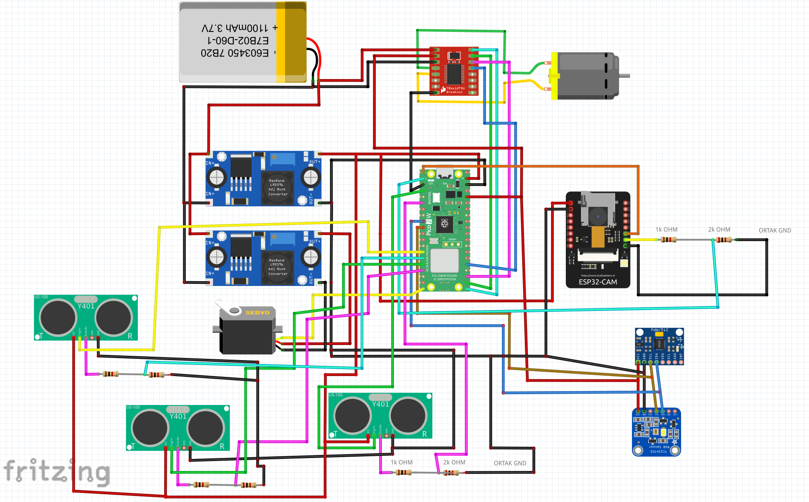
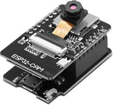
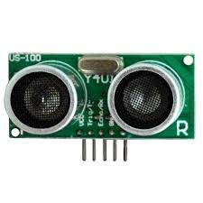

# Electronics Schemes

This directory documents the electronics used in the WRO 2026 Future Engineers robot. It includes the complete wiring scheme and a bill of materials for the main controller, sensors, motor driver, power system, drive motor, and steering servo.

## Main Wiring Scheme

The wiring scheme is built around a Raspberry Pi Pico 2 W H controller. The Pico controls the motor driver, steering servo, two US-100 ultrasonic sensors, MPU6050 IMU, and TCS34725 color sensor. The ESP32-CAM works as a separate vision module and sends camera detections to the Pico over UART.

## Complete Bill of Materials (BOM)

| Component | Image | Quantity | Type | Description |
| --- | --- | ---: | --- | --- |
| Raspberry Pi Pico 2 W H |  | 1 | Main microcontroller | Runs the MicroPython control code for steering, motor control, sensor reading, open round, and obstacle round behavior. |
| ESP32-CAM |  | 1 | Camera module | Detects red and green obstacles and sends compact UART messages to the Pico. |
| TB6612FNG |  | 1 | Motor driver | Drives the 6 V DC motor using PWM and direction signals from the Pico. |
| 6 V micro DC motor |  | 1 | Drive motor | Provides propulsion for the vehicle through the drivetrain. |
| HD-1440A servo |  | 1 | Steering servo | Controls the steering mechanism and receives PWM commands from the Pico. |
| US-100 ultrasonic sensor |  | 3 | Distance sensor | Measures distance for wall detection, corner detection, and safety checks. Sensor 1: GPIO 10/11. Sensor 2: GPIO 12/13. Sensor 3: GPIO 2/3. |
| MPU9250 |  | 1 | IMU / gyro sensor | Provides yaw-rate data for heading correction, 90-degree turns, and recovery after obstacle passing. |
| TCS34725 |  | 1 | Color sensor | Reference/backup color sensing module for future color-based improvements. |
| LM2596 / RT3505 buck converter |  | 2 | Voltage regulator | Steps battery voltage down for electronics and actuator rails. Output voltage must be checked before connecting modules. |
| 2S 450 mAh LiPo battery |  | 1 | Battery | Main robot power source. Feeds the regulator stage through the main switch. |
| On/off switch |  | 1 | Power switch | Enables safe manual power control for the robot. |

## Cable and Connection Specifications

All voltage values are nominal. Current values are worst-case peaks unless otherwise noted.

### 1. Main Power Source and Regulator Inputs

The 2S LiPo battery output (7.4 V nominal, 8.4 V fully charged) feeds three destinations through the main on/off switch.

| From | To | Voltage | Peak Current | Notes |
| --- | --- | ---: | ---: | --- |
| 2S LiPo (+) | On/off switch (input) | 7.4–8.4 V | 2.5 A | System peak: motor under load + servo moving + camera streaming |
| On/off switch (output) | Buck converter 1 (IN+) | 7.4–8.4 V | 0.6 A | Logic rail input |
| On/off switch (output) | Buck converter 2 (IN+) | 7.4–8.4 V | 1.0 A | Servo rail input |
| On/off switch (output) | TB6612FNG VM | 7.4–8.4 V | 1.0 A | Direct battery voltage to motor power pin — motor must tolerate 2S voltage |
| 2S LiPo (−) | Common GND bus | 0 V | — | Shared ground for all modules |

The TB6612FNG VM pin receives direct battery voltage. The DC motor therefore runs at 7.4–8.4 V. Motor current varies between 300 mA and 1 A depending on PWM duty cycle and mechanical load.

### 2. Buck Converter Outputs

Both buck converters step the battery voltage down to 5 V efficiently.

#### Buck Converter 1 — System Rail (5 V output)

| From | To | Voltage | Current | Notes |
| --- | --- | ---: | ---: | --- |
| Buck 1 (OUT+) | Pico 2 W H VBUS | 5.0 V | 50–100 mA | Pico draws more during heavy computation |
| Buck 1 (OUT+) | ESP32-CAM 5V | 5.0 V | 100–400 mA | ~100 mA idle; up to 400 mA when Wi-Fi and flash are active |
| Buck 1 (OUT+) | TB6612FNG VCC | 5.0 V | 1–5 mA | Logic supply only; motor power comes directly from battery |
| Buck 1 (OUT−) | Common GND bus | 0 V | — | |

Total Buck 1 output load: approximately **400–500 mA**.

#### Buck Converter 2 — Servo Rail (5 V or 6 V output)

| From | To | Voltage | Current | Notes |
| --- | --- | ---: | ---: | --- |
| Buck 2 (OUT+) | HD-1440A servo power (red wire) | 5.0 V (or 6.0 V) | 10–1000 mA | ~10 mA idle; up to 1 A instantaneous peak under mechanical load or sudden movement |
| Buck 2 (OUT−) | Common GND bus | 0 V | — | |

Set Buck 2 to **5 V** as default. Switching to **6 V** provides higher torque and speed if the servo and wiring support it.

### 3. Sensors Powered from Pico 3.3 V

The Pico 2 W H converts its 5 V VBUS input to a clean 3.3 V rail through its onboard regulator and feeds all sensors.

| From | To | Voltage | Current | Notes |
| --- | --- | ---: | ---: | --- |
| Pico 3V3 (OUT) | TCS34725 VCC | 3.3 V | ~5 mA | Includes onboard LED current |
| Pico 3V3 (OUT) | MPU6050 VCC | 3.3 V | ~4 mA | Gyro and accelerometer combined |
| Pico GND | All sensor GNDs | 0 V | — | Common reference for all I2C and UART signals |

Total Pico 3.3 V rail load: approximately **9–10 mA** (well within the 300 mA regulator limit).

The three US-100 sensors are powered from **Buck 1 (5 V)**, not the Pico 3.3 V rail.

| From | To | Voltage | Current | Notes |
| --- | --- | ---: | ---: | --- |
| Buck 1 (OUT+) | US-100 #1 VCC | 5.0 V | ~8 mA | Sensor 1 — GPIO 10/11 |
| Buck 1 (OUT+) | US-100 #2 VCC | 5.0 V | ~8 mA | Sensor 2 — GPIO 12/13 |
| Buck 1 (OUT+) | US-100 #3 VCC | 5.0 V | ~8 mA | Sensor 3 — GPIO 2/3 |

### 4. Signal and Data Lines

| From | To | Signal Voltage | Notes |
| --- | --- | ---: | --- |
| Pico GPIO 14 (PWM) | HD-1440A servo signal (yellow wire) | 3.3 V | 50 Hz PWM, 1–2 ms pulse width |
| Pico GPIO 16 (PWM) | TB6612FNG PWMA | 3.3 V | Motor speed control |
| Pico GPIO 17 | TB6612FNG AIN2 | 3.3 V | Motor direction |
| Pico GPIO 18 | TB6612FNG AIN1 | 3.3 V | Motor direction |
| Pico GPIO 19 | TB6612FNG STBY | 3.3 V | Must be HIGH to enable motor output |
| Pico GPIO 4 (SDA) | MPU6050 SDA / TCS34725 SDA | 3.3 V | Shared I2C data bus; 4.7 kΩ pull-up to 3.3 V recommended |
| Pico GPIO 5 (SCL) | MPU6050 SCL / TCS34725 SCL | 3.3 V | Shared I2C clock bus; 4.7 kΩ pull-up to 3.3 V recommended |
| Pico GPIO 10 (TRIG) | US-100 #1 TRIG | 3.3 V | 10 µs trigger pulse — Sensor 1; US-100 TRIG accepts 3.3 V |
| US-100 #1 ECHO | 1 kΩ + 2 kΩ divider → Pico GPIO 11 | 5 V → 3.3 V | ECHO output is 5 V; resistor divider steps to 3.3 V for Pico. ~1.6 mA line current |
| Pico GPIO 12 (TRIG) | US-100 #2 TRIG | 3.3 V | 10 µs trigger pulse — Sensor 2; US-100 TRIG accepts 3.3 V |
| US-100 #2 ECHO | 1 kΩ + 2 kΩ divider → Pico GPIO 13 | 5 V → 3.3 V | ECHO output is 5 V; resistor divider steps to 3.3 V for Pico. ~1.6 mA line current |
| Pico GPIO 2 (TRIG) | US-100 #3 TRIG | 3.3 V | 10 µs trigger pulse — Sensor 3; US-100 TRIG accepts 3.3 V |
| US-100 #3 ECHO | 1 kΩ + 2 kΩ divider → Pico GPIO 3 | 5 V → 3.3 V | ECHO output is 5 V; resistor divider steps to 3.3 V for Pico. ~1.6 mA line current |
| ESP32-CAM TX | 1 kΩ + 2 kΩ divider → Pico GPIO 1 (UART RX) | 5 V → 3.3 V | ESP32-CAM TX is 5 V logic. The resistor divider steps it to 3.3 V for the Pico RX pin. Line current ~1.6 mA. |
| Pico GPIO 0 (UART TX) | ESP32-CAM RX | 3.3 V | Pico TX at 3.3 V is within ESP32-CAM input range; no level shifting needed |

### Current Budget Summary

| Rail | Consumers | Typical | Peak |
| --- | --- | ---: | ---: |
| Battery direct — TB6612FNG VM | DC motor | 300 mA | 1.0 A |
| Buck 1 — 5 V logic | Pico (100 mA) + ESP32-CAM (400 mA) + TB6612FNG VCC (5 mA) + US-100 ×3 (24 mA) | 274 mA | 529 mA |
| Buck 2 — servo rail | HD-1440A servo | 10 mA | 1.0 A |
| Pico 3.3 V out | MPU6050 (4 mA) + TCS34725 (5 mA) | 9 mA | 10 mA |
| **Battery total** | **All rails** | **~560 mA** | **~2.5 A** |

The 2S LiPo battery voltage (7.4–8.4 V) is passed directly to the TB6612FNG motor driver to maximize motor efficiency. Logic and servo voltages are regulated down to 5 V by LM2596 buck converters for stable, repeatable behavior across the battery discharge curve.

Before first power-on, measure Buck 1 output and set it to **5.0 V**, then measure Buck 2 output and set it to **5.0 V** (or **6.0 V** for the servo). Do not connect any board until both outputs are confirmed.

## Signal and Power Summary

| Connection group | Modules | Notes |
| --- | --- | --- |
| Motor control | Pico 2 W H -> TB6612FNG -> DC motor | PWM controls speed, direction pins control motor direction. |
| Steering | Pico 2 W H -> HD-1440A servo | Servo limits are tuned in `src/servo_tune.py`. |
| Distance sensing | Pico 2 W H -> US-100 #1 (GPIO 10/11) + US-100 #2 (GPIO 12/13) | Two sensors used by `src/openround.py` and `src/obstacleround.py` for wall/corner detection from different directions. |
| Gyro heading | Pico 2 W H -> MPU9250 | I2C gyro data is used for yaw estimation and turn completion. |
| Camera UART | ESP32-CAM -> Pico 2 W H | The camera sends `RED`, `GREEN`, or `NONE` messages for obstacle logic. |
| Color sensing | Pico 2 W H -> TCS34725 | Reserved as an extra color sensing module. |
| Power regulation | LiPo -> switch -> buck converters -> modules | All grounds must be common. Regulator outputs must be measured before testing. |

## Power Budget and Rail Plan

The robot separates high-current actuator loads from logic/sensor loads so motor noise does not reset the controller or corrupt sensor data.

| Rail | Loads | Reason |
| --- | --- | --- |
| Battery input | Main switch, buck converters | Keeps the battery path short and easy to disconnect during testing. |
| Motor/servo rail | TB6612FNG motor supply and steering servo supply | Handles current spikes from acceleration, braking, and fast steering changes. |
| Logic rail | Pico 2 W H, ESP32-CAM, MPU6050, TCS34725, US-100 ×2 logic | Keeps controller and sensor voltage stable during motor load changes. |
| Common ground | All modules | Required for PWM, UART, I2C, trigger/echo, and camera signals to share the same reference. |

Expected current risks:

- The ESP32-CAM can draw high current during Wi-Fi/camera startup, so it should not share a weak rail with the Pico without enough regulator margin.
- The steering servo can create voltage dips when held against mechanical load.
- The drive motor can inject noise into the supply through the TB6612FNG if wiring is long or loose.

The chosen architecture uses buck converters because the battery voltage is higher than the safe voltage for logic boards and because a regulated rail gives repeatable sensor behavior across the battery discharge curve.

## Sensor Placement Reasoning

| Sensor | Placement reason | Trade-off |
| --- | --- | --- |
| ESP32-CAM | Mounted high enough to see colored obstacles before the vehicle reaches them. | Higher mounting improves view, but increases vibration sensitivity. |
| US-100 #1 (GPIO 10/11) | Faces forward to detect walls and corners early enough for a 90-degree turn. | Very close readings can be noisy, so software filters unrealistic distances. |
| US-100 #2 (GPIO 12/13) | Mounted to cover a second direction (side or rear) for expanded spatial awareness. | Both sensors share the same filtering logic; trigger pulses are staggered to avoid crosstalk. |
| MPU9250 | Placed near the chassis center to reduce rotational measurement error from vibration. | Needs startup calibration while the robot is still. |
| TCS34725 | Kept as a reference/backup color sensor for future color validation. | Not part of the current primary obstacle algorithm. |

## Calibration and Fault Management

| Check | Method | Failure response |
| --- | --- | --- |
| Voltage rails | Measure buck converter outputs with a multimeter before connecting boards. | Do not connect electronics until output voltage is corrected. |
| I2C sensors | Confirm MPU9250/TCS34725 addresses are detected. | Stop the run and inspect SDA/SCL, power, and ground wiring. |
| UART camera | Verify `RED`, `GREEN`, and `NONE` messages before autonomous runs. | Use `src/camera_uart_blink.py` for isolated UART testing. |
| Ultrasonic distance | Compare US-100 readings against known distances. | Reject readings below the configured minimum and inspect trigger/echo wiring. |
| Motor polarity | Test with wheels lifted from the ground. | Swap motor leads or invert direction logic before track testing. |
| Servo direction | Run `src/servo_tune.py`. | Adjust servo reverse/settings before autonomous code is used. |

## Safety Checklist

- Check every buck converter output with a multimeter before connecting electronics.
- Keep the Pico, ESP32-CAM, motor driver, sensors, and power system on a common ground.
- Confirm UART TX/RX wiring direction between the ESP32-CAM and Pico.
- Confirm the US-100 echo signal is safe for Pico input voltage.
- Test the servo direction before running autonomous code.
- Test motor direction with wheels lifted from the ground.
- Secure the LiPo battery physically before driving.
- Use the switch to cut power quickly during bench tests.

## Software Mapping

| Software file | Electronics used |
| --- | --- |
| `src/camera.cpp` | ESP32-CAM |
| `src/camera_uart_blink.py` | ESP32-CAM UART output and Pico onboard LED |
| `src/openround.py` | Pico, servo, TB6612FNG, DC motor, US-100 ×2 (GPIO 10/11 + 12/13), MPU6050 |
| `src/obstacleround.py` | Pico, ESP32-CAM, servo, TB6612FNG, DC motor, US-100 ×2 (GPIO 10/11 + 12/13), MPU6050 |
| `src/servo_tune.py` | Pico, steering servo, MPU6050 |

This folder should be updated whenever the electronics layout, wiring, power system, or sensor placement changes.
