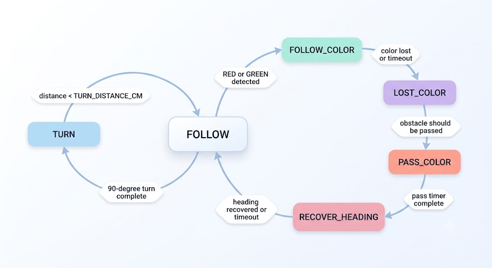
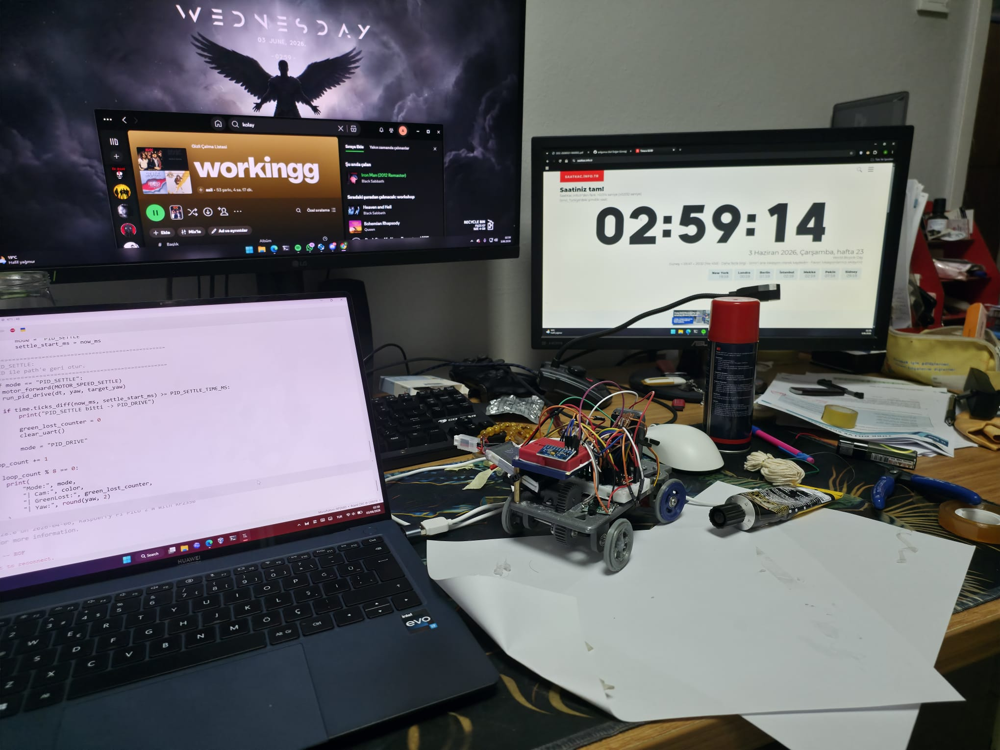

# WRO 2026 Future Engineers Software Documentation

This folder contains the robot source code for Team CYBERRCORE's WRO 2026 Future Engineers vehicle. The software is split between an ESP32-CAM vision module written in Arduino C++ and MicroPython control utilities for open round, obstacle round, sensor, UART, and servo tuning. This documentation was last updated on June 4, 2026.

## Software Architecture Overview

The current software is organized around two main roles:

- **ESP32-CAM vision module**: Captures low-resolution RGB565 frames, detects red and green objects, and sends compact serial messages.
- **MicroPython vehicle controller utilities**: Drive the steering servo, motor driver, ultrasonic distance sensor, and MPU9250 gyro for open-round navigation, obstacle-round navigation, and calibration.
- **UART communication**: Vision output uses newline-terminated messages at 115200 baud, allowing another board to react to camera detections.

The system keeps the runtime logic simple and deterministic. The camera module only reports color and horizontal position, while the vehicle control code handles movement, turning, and tuning.

```text
ESP32-CAM camera.cpp
        |
        | Serial: COLOR,x,count
        v
MicroPython UART reader
        |
        v
LED debug / vehicle control integration

MicroPython openround.py
        |
        +-- TB6612FNG motor driver
        +-- Steering servo
        +-- US-100 ultrasonic distance sensor
        +-- MPU9250 gyro over I2C

MicroPython obstacleround.py
        |
        +-- ESP32-CAM UART color obstacle data
        +-- Gyro heading correction
        +-- US-100 corner detection
        +-- Lap and corner counting
        +-- Run log output
```

## Programming Environment and Tools

### ESP32-CAM Vision Module

- **Language**: Arduino C++
- **Target board**: AI Thinker ESP32-CAM
- **Main library**: `esp_camera`
- **Camera format**: RGB565
- **Frame size**: QQVGA, 160x120
- **Output protocol**: Serial at 115200 baud

### MicroPython Controller Utilities

- **Language**: MicroPython
- **Hardware APIs**: `machine.Pin`, `machine.PWM`, `machine.I2C`, `machine.UART`
- **Actuators**: Steering servo and TB6612FNG motor driver
- **Sensors**: MPU9250 gyro and US-100 ultrasonic distance sensor
- **Debugging**: Console output and onboard LED blink feedback

## Core Software Components

| File | Language | Purpose |
| --- | --- | --- |
| [`camera.cpp`](camera.cpp) | Arduino C++ | ESP32-CAM color detection for red and green objects |
| [`camera_uart_blink.py`](camera_uart_blink.py) | MicroPython | UART receiver test that blinks LED on camera color messages |
| [`openround.py`](openround.py) | MicroPython | Open-round drive logic with gyro-assisted 90-degree corner turns |
| [`obstacleround.py`](obstacleround.py) | MicroPython | Obstacle-round logic combining camera color tracking, gyro recovery, corner turns, and lap counting |
| [`servo_tune.py`](servo_tune.py) | MicroPython | Servo center, direction, and PID steering tuning utility |

## Vision System

The ESP32-CAM code reads RGB565 frames at 160x120 resolution and scans the lower part of the image. Scanning starts at `ROI_Y_START = 30` and skips pixels with `STEP_X = 2` and `STEP_Y = 2` to reduce processing time.

### Color Detection Strategy

The camera converts each RGB565 pixel into RGB888 values and checks threshold rules:

- **Red**: high red channel, low green and blue channels, and red dominance over both other channels.
- **Green**: high green channel, limited red and blue channels, and green dominance over both other channels.
- **Minimum area**: detections must exceed `RED_MIN_AREA` or `GREEN_MIN_AREA`.

When both colors are visible, red is prioritized if it has at least as much detected area as green.

### Camera Output Format

The camera writes one line per frame:

```text
RED,<center_x>,<pixel_count>
GREEN,<center_x>,<pixel_count>
NONE
```

This compact format is easy to parse on a second microcontroller and avoids sending full images over UART.

## Open Round Navigation

`openround.py` implements a simple open-round strategy for repeated corner turns:

1. Center the servo and calibrate the gyro.
2. Drive straight with PID steering toward `target_yaw`.
3. Read front distance with the US-100 sensor.
4. If an obstacle or wall is closer than `TURN_DISTANCE_CM`, enter turn mode.
5. Hold full steering left or right until the gyro reports about 90 degrees of yaw change.
6. Reset yaw, briefly ignore corner detection, and continue.
7. After `STOP_AFTER_TURNS = 16`, drive straight briefly and stop.

### State Machine


## Obstacle Round Navigation

`obstacleround.py` extends the base driving system for the WRO obstacle round. It combines camera color detections, gyro heading control, ultrasonic corner detection, and a multi-state obstacle passing routine.

### Obstacle Strategy

The ESP32-CAM reports colored obstacle data over UART. The obstacle-round script uses this information to choose a passing line:

- **Red obstacle**: keep the red object on the left side of the camera view so the robot passes on its right.
- **Green obstacle**: keep the green object on the right side of the camera view so the robot passes on its left.
- **No obstacle visible**: continue gyro-assisted forward driving and use ultrasonic distance to detect corners.

The target camera positions are:

| Obstacle | Target camera x | Intended pass side |
| --- | --- | --- |
| Red | `RED_TARGET_X = 48` | Pass on the right |
| Green | `GREEN_TARGET_X = 112` | Pass on the left |

### Obstacle State Machine



### Lap and Corner Counting

The obstacle-round script tracks `corner_count` and `lap_count`. After every four corners, one lap is counted. The robot stops when `REQUIRED_LAPS = 3` is reached.

### Logging

`obstacleround.py` can write runtime data to `run_log.txt`. The log records mode changes, calibration events, snapshots, corner turns, lap completions, and unexpected exceptions. This helps diagnose behavior after a physical run without relying only on live console output.

### Edge Cases and Mitigations

| Risk | Mitigation in code |
| --- | --- |
| False ultrasonic readings at very short range | Distances below `MIN_VALID_DISTANCE_CM` are rejected and close-stop logic requires repeated close readings. |
| Same wall counted twice after a turn | `TURN_IGNORE_AFTER_TURN_MS` blocks immediate corner re-triggering. |
| Corner triggered while avoiding an obstacle | `TURN_IGNORE_AFTER_COLOR_MS` delays corner detection after color tracking starts. |
| Camera briefly loses the obstacle | `LOST_COLOR` keeps a short bias based on the last known color instead of instantly returning to normal driving. |
| Two obstacles appear close together | `chain_active` extends pass duration and increases pass bias for chained red/green patterns. |
| Gyro drift after major maneuvers | Yaw and PID state are reset after turns and recovery events. |
| UART buffer noise or partial messages | The buffer is bounded and lines are parsed only after newline termination. |

## Control System

The steering controller uses a basic PID loop:

```python
error = target_yaw - yaw
integral += error * dt
derivative = (error - last_error) / dt
output = (KP * error) + (KI * integral) + (KD * derivative)
```

The correction is applied around `SERVO_CENTER`. If `SERVO_REVERSE` is enabled, positive correction moves the servo in the opposite direction. This makes the same control code usable when the steering linkage orientation changes.

Current tuning values:

| Parameter | Value |
| --- | --- |
| `SERVO_MIN` | 30 |
| `SERVO_CENTER` | 65 |
| `SERVO_MAX` | 100 |
| `KP` | 1.8 |
| `KI` | 0.00 |
| `KD` | 0.25 |
| `MOTOR_SPEED_STRAIGHT` | 30 |
| `MOTOR_SPEED_TURN` | 50 |

Obstacle-round tuning values:

| Parameter | Value |
| --- | --- |
| `SERVO_MIN` | 50 |
| `SERVO_CENTER` | 65 |
| `SERVO_MAX` | 80 |
| `MOTOR_SPEED_FOLLOW` | 65 |
| `MOTOR_SPEED_COLOR` | 48 |
| `MOTOR_SPEED_PASS` | 42 |
| `MOTOR_SPEED_TURN` | 57 |
| `TURN_DISTANCE_CM` | 45 |
| `STOP_DISTANCE_CM` | 6 |
| `KP_HEADING` | 2.4 |
| `KD_HEADING` | 0.35 |

## Engineering Decisions and Trade-offs

| Decision | Why it was chosen | Trade-off |
| --- | --- | --- |
| Separate ESP32-CAM vision module | Keeps camera processing off the main Pico controller and gives a simple UART interface. | Requires a second board and stable serial wiring. |
| RGB thresholding instead of ML | Runs fast on ESP32-CAM and is easy to tune on the track. | Sensitive to lighting, so threshold calibration is needed. |
| Gyro-based turn completion | More repeatable than timing-only turns. | Requires startup calibration and drift handling. |
| US-100 for corner detection | Simple, cheap, and direct front-wall measurement. | Needs filtering for close-range noise. |
| State machine control | Easy to debug and explain during judging. | More states require careful transition timing. |
| Logging to `run_log.txt` | Allows post-run diagnosis without watching serial output live. | Writes are limited by MicroPython filesystem reliability and should not be too frequent. |

## Test Plan and Acceptance Criteria

| Test | Procedure | Pass criteria |
| --- | --- | --- |
| Camera color detection | Show red, green, and no object to ESP32-CAM. | Serial output changes between `RED`, `GREEN`, and `NONE` within one frame loop. |
| UART receiver | Run `camera_uart_blink.py` with camera connected. | Red gives one blink, green gives two blinks, repeated same color does not spam blinks. |
| Servo direction | Run `servo_tune.py` while the robot is lifted. | Center, left, right, and PID correction directions match the steering geometry. |
| Gyro calibration | Keep robot still during startup. | Yaw remains near zero while stationary and changes consistently during rotation. |
| Ultrasonic distance | Place a wall at known distances. | Readings are stable and impossible close readings are filtered. |
| Open round | Run `openround.py` on a practice track. | Robot completes repeated 90-degree turns without double-counting the same wall. |
| Obstacle round | Run `obstacleround.py` with red/green obstacles. | Red is passed on the correct side, green is passed on the correct side, and heading recovers after each pass. |

## UART Test Utility

`camera_uart_blink.py` validates the camera serial output without needing the full vehicle logic. It reads UART lines and blinks the onboard LED:

- `RED` -> one blink
- `GREEN` -> two blinks
- `NONE` -> re-arms the detector

The script avoids repeated blinking while the same color remains visible. This makes it easier to confirm whether the camera is detecting new objects or continuously seeing the same object.

## Servo Tuning Utility

`servo_tune.py` helps tune steering limits and center position:

1. Center the servo.
2. Calibrate the MPU9250 gyro.
3. Hold straight using the PID controller for `PID_START_TIME_MS`.
4. Move to `TEST_SERVO_ANGLE`.
5. Keep the servo at that angle for mechanical inspection.

This is useful for checking whether `SERVO_MIN`, `SERVO_CENTER`, `SERVO_MAX`, and `SERVO_REVERSE` match the physical steering geometry.

## Hardware Pin Summary

### MicroPython Controller

| Signal | Pin |
| --- | --- |
| Servo PWM | 14 |
| Motor PWMA | 16 |
| Motor AIN2 | 17 |
| Motor AIN1 | 18 |
| Motor STBY | 19 |
| I2C SDA | 4 |
| I2C SCL | 5 |
| Ultrasonic TRIG | 10 |
| Ultrasonic ECHO | 11 |
| Camera UART TX | 0 |
| Camera UART RX | 1 |

### AI Thinker ESP32-CAM

The ESP32-CAM pin mapping follows the standard AI Thinker camera layout in `camera.cpp`, including XCLK on GPIO0, SCCB on GPIO26/GPIO27, and RGB data pins on GPIO5, GPIO18, GPIO19, GPIO21, GPIO34, GPIO35, GPIO36, and GPIO39.

## Testing and Validation

Recommended validation order:

1. Upload `camera.cpp` to the ESP32-CAM and confirm `ESP32_CAM_READY`.
2. Place red and green objects in view and confirm serial messages.
3. Run `camera_uart_blink.py` on the MicroPython controller and verify LED blink behavior.
4. Run `servo_tune.py` to confirm steering limits and PID direction.
5. Run `openround.py` on blocks or a safe test area to verify motor direction.
6. Test the full open-round behavior on the WRO track at low speed first.
7. Run `obstacleround.py` after camera UART output, steering direction, gyro calibration, and ultrasonic distance readings are confirmed.

## Deployment Instructions

### ESP32-CAM

1. Open `camera.cpp` in the Arduino IDE or compatible ESP32 build environment.
2. Select the AI Thinker ESP32-CAM board profile.
3. Build and upload the firmware.
4. Open the serial monitor at 115200 baud.
5. Confirm that `ESP32_CAM_READY` appears.

### MicroPython Controller

Copy the required `.py` file to the MicroPython board filesystem:

```bash
cp openround.py /path/to/micropython-board/
cp obstacleround.py /path/to/micropython-board/
cp servo_tune.py /path/to/micropython-board/
cp camera_uart_blink.py /path/to/micropython-board/
```

Rename the active script to `main.py` if automatic startup is needed.

## Photo Documentation

The source documentation includes development photos to show the physical robot setup, wiring work, and track testing process.

### Open-Round Track Test


This photo shows the robot being tested in a handmade open-round practice field. The cardboard walls were used as a quick simulation of the WRO Future Engineers track boundaries while tuning the ultrasonic corner detection, gyro-based turn counting, and steering behavior.

### Bench Build and Wiring



This photo shows the robot during bench development with the controller, wiring, laptop, and test environment visible. It documents the practical debugging setup used while working on the camera, UART, servo, and drive-control code.

Recommended additional documentation photos:

- Full robot wiring layout
- ESP32-CAM mount and field of view
- Servo linkage and center position
- MPU9250 and US-100 placement
- Close-up of the drive motor and steering assembly

## Engineering Notes

- The camera intentionally uses a small frame size and pixel skipping for faster detection.
- The gyro is calibrated at startup, so the robot must stay still during calibration.
- `TURN_IGNORE_AFTER_TURN_MS` prevents the same wall from being counted as a new corner immediately after turning.
- The obstacle-round script ignores corner triggers briefly after color detection so obstacle passing does not accidentally start a corner turn.
- `run_log.txt` is generated on the MicroPython board during obstacle-round runs when logging is enabled.
- The code favors simple thresholds and state machines so behavior can be tuned quickly during physical testing.

## Future Improvements

- Align the ESP32-CAM output format across open-round tests and obstacle-round mode.
- Save tuning constants in a separate configuration file.
- Add separate test scripts for motor, ultrasonic sensor, gyro, and UART.
- Add lighting-condition calibration notes for red and green thresholds.
- Add photos and short videos linked from the documentation folders.

---

This source documentation is intended to make the WRO Future Engineers software understandable, testable, and easy to tune during robot development.
