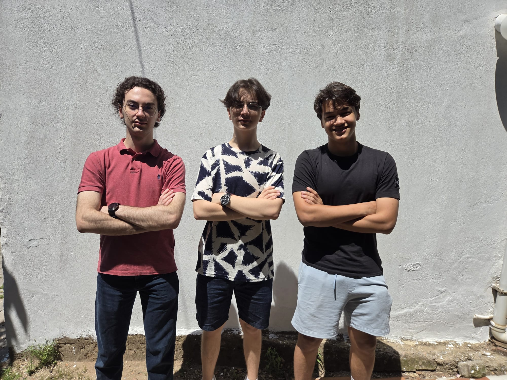
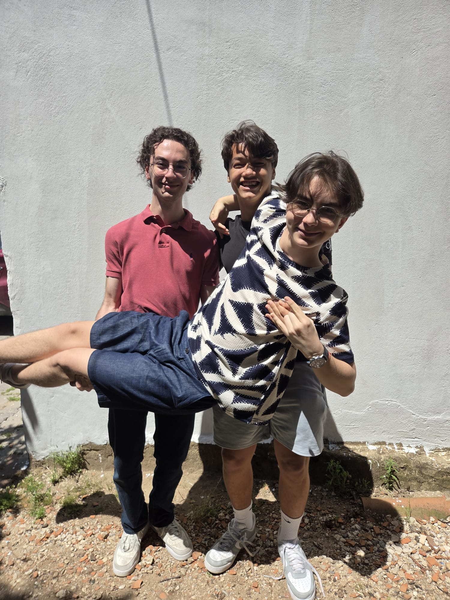

# Team Photos

Two photos of Team CYBERRCORE — the people behind the robot.

---

### Official Photo — `normal.jpeg`

---

### Fun Photo — `fun.jpeg`

---

We are a three-person team from Turkey, competing in the WRO 2026 Future Engineers category. We design, build, and program our robot entirely from scratch — from CAD modeling in SolidWorks to writing the control software on the ESP32.
