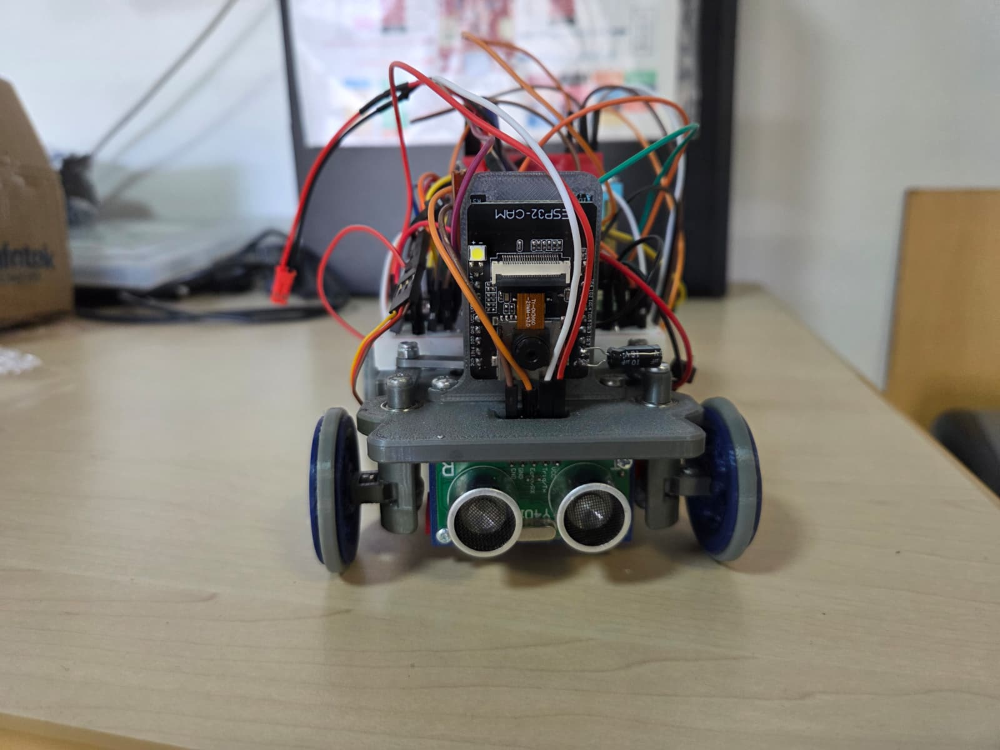
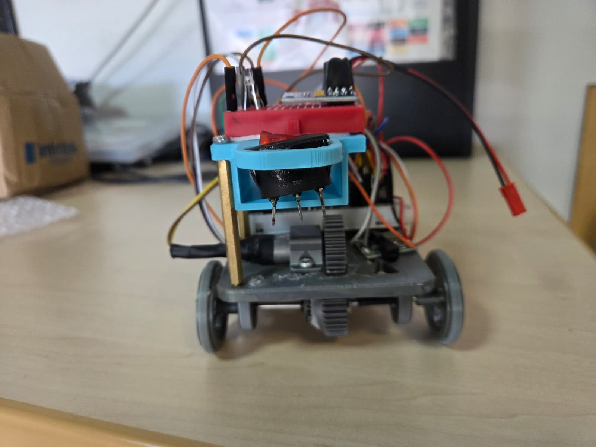
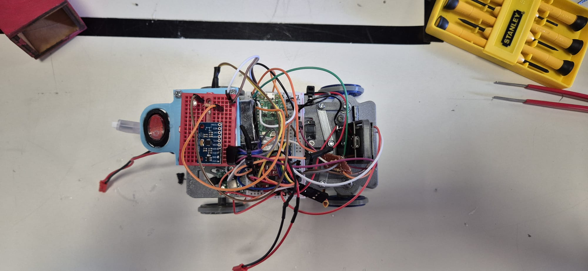
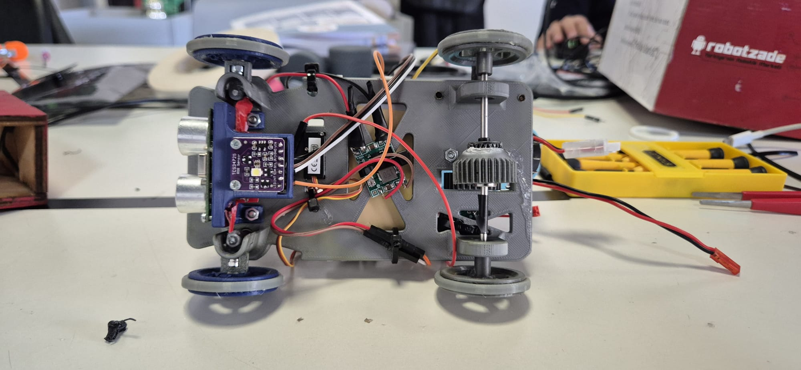
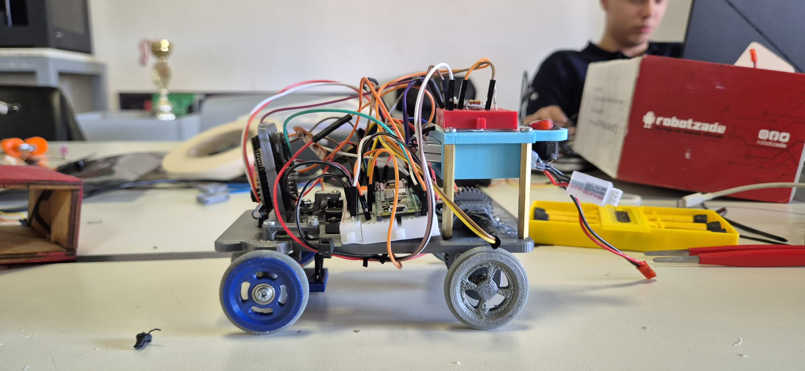
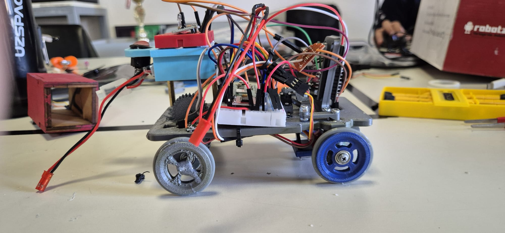

# Vehicle Photos

Six orthographic photos of the CYBERRCORE prototype, taken from front, rear, top, bottom, left and right. The robot is currently in active development — wiring runs on a breadboard platform and cable routing is not yet finalized. Photos reflect the real build state, not a polished final assembly.

---

### `front.jpeg`

The front face of the robot. The **ESP32-CAM** sits on its custom 3D printed bracket at center, camera lens aimed forward for track and obstacle detection. Directly below the chassis nose, the **US-100 ultrasonic sensor** (green PCB with dual transducers) is mounted flush for forward distance measurement. Both front wheels use blue hub rims with pressed **3×10×4 bearings** and rubber O-ring tires.

---

### `rear_view.jpeg`

The rear of the robot exposes the drivetrain exit point: the **0.8M 31T spur gear** on the rear axle is clearly visible at center. The **brushed DC drive motor** sits behind it in its U-bracket mount. The large black **toggle power switch** is accessible from the rear for easy field use. The elevated breadboard platform with the motor driver and control modules sits on top, and the **red JST battery connector** hangs free on the right side.

---

### `top_view.jpeg`

Bird's-eye view showing the full electronics layout. The **red breadboard** on the left carries all prototype circuitry — motor driver, sensor breakout modules, and interconnects. The **ESP32-CAM** is visible toward the front-left. Bamboo/wooden support columns raise the electronics layer above the chassis deck. The dense jumper wire harness is typical of the development stage and will be replaced with consolidated wiring for competition.

---

### `bottom_view.jpeg`

The underside reveals the full mechanical layout. On the front-left, the **Ackermann steering linkage** is visible — servo arm, tie rod, and wheel knuckles working together so both front wheels turn toward the correct center point. The **steering servo** sits just inboard of the front axle. On the rear-right, the **0.8M spur gear pair** (1:1 ratio) transfers motor torque to the rear through-axle. A small **blue sensor module** (IMU or color sensor) is mounted flat to the chassis underside. The X-pattern lightening pockets in the chassis plate are visible throughout.

---

### `left_view.jpeg`

Full left-side profile. The height hierarchy of the robot is clear: flat chassis base at the bottom, electronics platform raised on support columns in the middle, and the ESP32-CAM tower at the top. The **blue front wheel** (steered, bearing hub) and **gray rear wheel** (driven, direct hub) show the intentional design difference between the two axles. The power switch and battery connector are accessible without turning the robot over.

---

### `right_view.jpeg`

The right side gives the clearest view of the **rear gear train** — motor, pinion gear, and axle driven gear are all visible here. The contrast between the blue front wheel hub and the plain gray rear wheel hub confirms the front uses a pressed bearing for free rotation while the rear hub is fixed to the axle. Wiring from the upper platform routes down through the chassis to the motor and servo along this side.

---

## Development Notes

These photos show a working prototype, not the final competition robot. Key things that will change before competition:

- Breadboard and jumper wires → consolidated wiring or custom PCB
- Exposed cable routing → managed harness with strain relief
- Support column structure → integrated chassis uprights if space permits

For mechanical part details: [Models Documentation](../models/README.md)  
For electrical schematics: [Schemes Documentation](../schemes/README.md)  
For software: [Software Documentation](../src/README.md)
